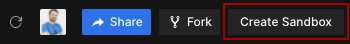
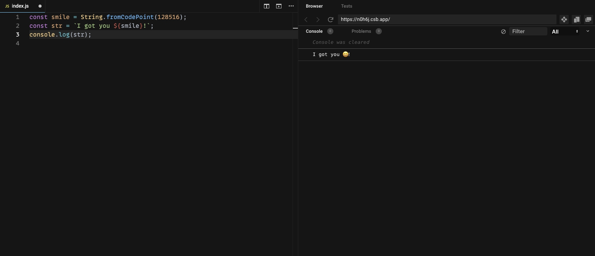
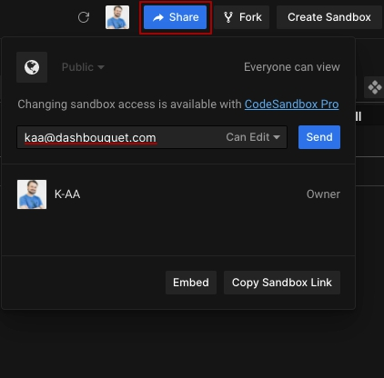

<div align="center">
    <a href="https://dashbouquet.com">
        
    </a>
    <br/>
</div>

<h1 align="center">JavaScript Assessment</h1>

## Description

This is a repo for pre-interview challenges for junior javascript position. Please use javascript for a solution language.

## Challenges

* [Lazily executing a function](lazily_executing_a_function.md)
* [Implementing Array.prototype.groupBy method](group_by_method.md)
* [Dashatize it](dashatize_it.md)
* [Lychrel number](lychrel_number.md)
* [HTML string from array data](html_string_from_array_data.md)

## How can You send a solution for challenges?

Just use [codesandbox.io](https://codesandbox.io/)

* Sign In/Sign Up in codesandbox.io
* Create sandbox with `JS` environment





* Write Your solutions for challenges in `index.js` file indicating the name of challenge as a comment

```javascript
/*Lazily executing a function*/

const MyAwesomeFunction = () => {
  //For my great solution
}
```

* After that just share your sandbox to my email `kaa@dashbouquet.com`



And good luck :wink: !
